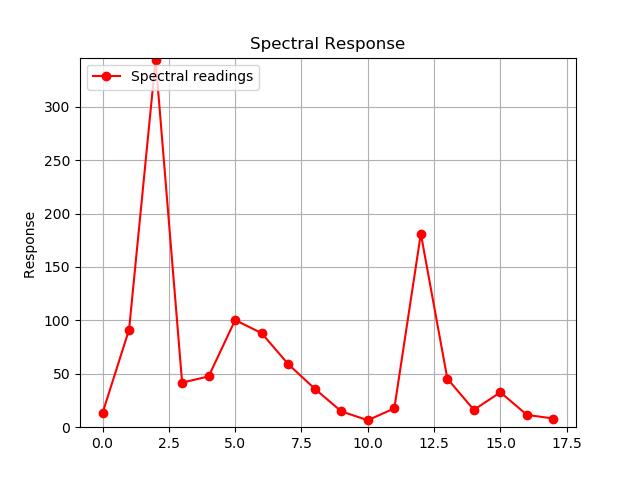

# pySpectralTriad
Graphical Visualization of Spectral Response from a SparkFun AS7265x Spectral Triad module using Python 2.7.x

<b>Disclaimer:</b> Never learned Python, so there is probably 1000 ways to do it better and cleaner. I just don't care 
            Code is provided as is.

<b>pySpectralTriadsimpleGraph.py</b> : Simple red 2D Plot with autoscaling

