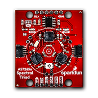
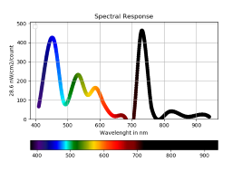

# pySpectralTriad
Graphical Visualization Apps of the Spectral Response from a <a href="https://www.sparkfun.com/products/15050">SparkFun AS7265x Spectral Triad module</a> using Python 2.7.x

- **Arduino Folder:** Arduino applications to control the AS7265x Spectral Triad
- **python27 Folder:** Python 2.7.x applications for different data visualization options
- **docs Folder:** Datasheets and other misc. stuff

<b>Disclaimer:</b> Never learned Python, so there are probably 1000 ways to do it better and cleaner. 
            Code is provided as is, under MIT License, because I can't stand viral licences!
