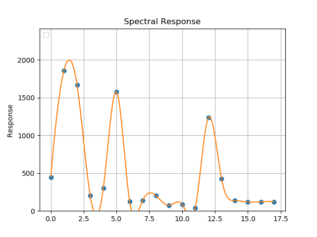
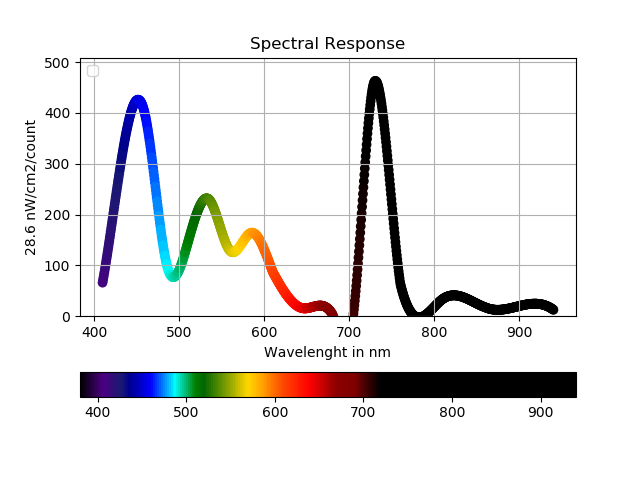

# Python 2.7.x apps

- **pySpectralTriadsimpleGraph.py:** Simple 2D Plot with autoscale  

!

- **pySpectralTriadsimpleGraph.py:** Cubic 2d interpolation plot with autoscale  

- **pySpectralTriadColoredScatter.py:** The whole shebang - colored scatterplot against wavelenght and colorbar with spectrum

